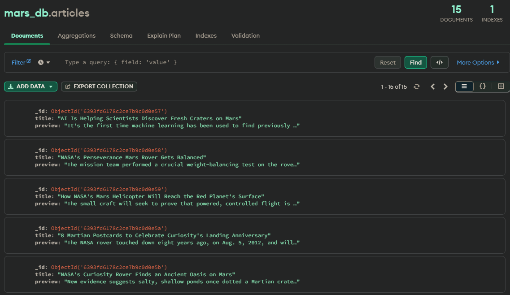
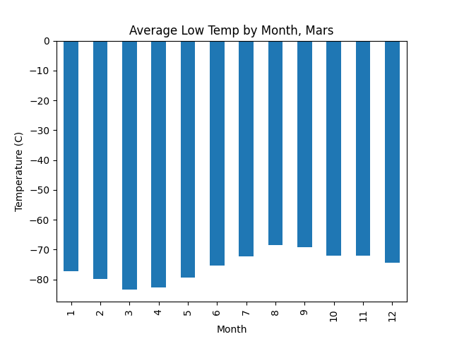
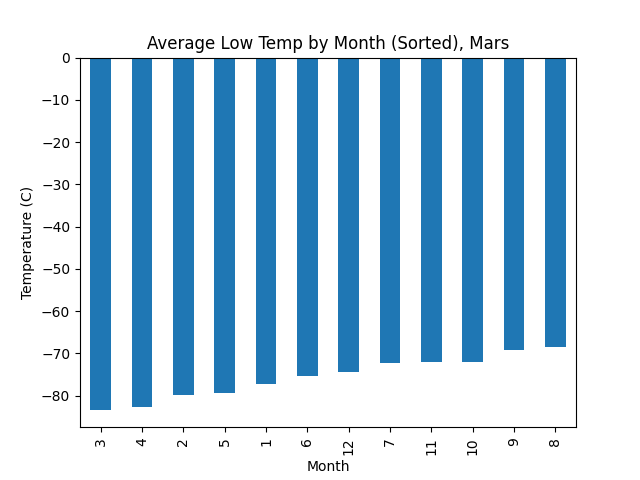
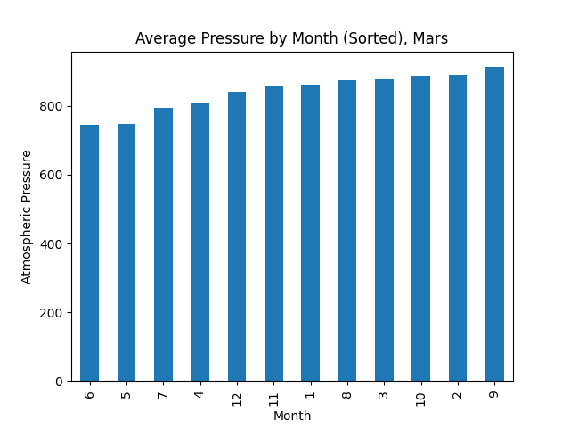
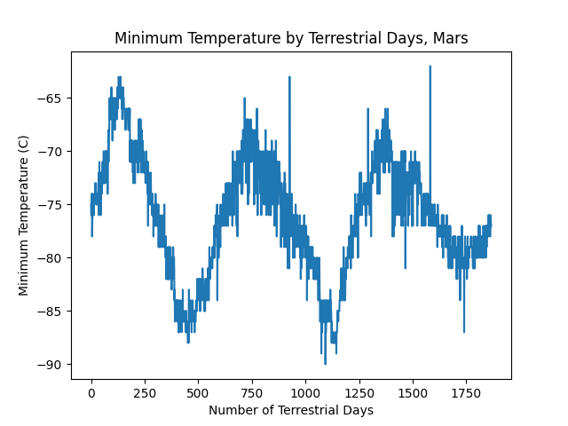

# web-scraping-challenge
This project consists of two technical products to deliver:
1. Scraped news titles and preview text regarding Mars
2. Analysis and plots of scraped mars weather data

## Libraries and Tools
- Splinter
- BeautifulSoup
- ChromeDriverManager
- Pandas
- Matplotlib
- JSON
- PyMongo

## Analysis
### Part 1 - Scrape Titles and Preview Text from Mars News
This script scrapes title and article preview text from [https://redplanetscience.com](https://replanetscience.com). These results were saved to a json file as well as to a MongoDB collection.

[link to mars json dataset](output/mars.json)

Screenshot of data uploaded to MongoDB:

### Part 2 - Scrape and Analyze Mars Weather Data
This script scrapes a web-based table of Mars' weather data for analysis and visualization in Python using Jupyter Notebook from [https://data-class-mars-challenge.s3.amazonaws.com/Mars/index.html](https://data-class-mars-challenge.s3.amazonaws.com/Mars/index.html). The scraped data from the website is stored to a [csv file](output/mars_weather.csv).

#### Questions Answered by Analysis
1. How many months exist on Mars? 12 months
2. How many Martian (and not Earth) days worth of data exist in the scraped dataset? 1867 days
3. What are the coldest and the warmest months on Mars (at the location of Curiosity)? To answer this question:
   - Find the average the minimum daily temperature for all of the months.
   - Plot the results as a bar chart.
   
   
4. Which months have the lowest and the highest atmospheric pressure on Mars? To answer this question:
   - Find the average the daily atmospheric pressure of all the months.
   - Plot the results as a bar chart.
   
5. About how many terrestrial (Earth) days exist in a Martian year? To answer this question:
   - Consider how many days elapse on Earth in the time that Mars circles the Sun once.
   - Visually estimate the result by plotting the daily minimum temperature.
   
